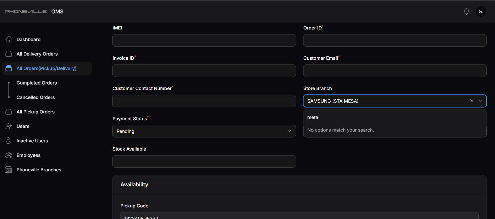

## License

The Laravel framework is open-sourced software licensed under the [MIT license](https://opensource.org/licenses/MIT).

---

Screenshots  

   
 

------------------

Laravel-based Order Management System for Phoneville Mobile Inc.

-----

SUPERADMIN
credentials: 
Email:giannejuson16@gmail.com  
Password: phoneville123/ 123phoneville 

ADMIN
credentials: 
Email:pandakeeyoob@gmail.com 
Password: phoneville123 

STORE_STAFF
credentials: 

Email: smigglespbear@gmail.com (an example of Inactive user, ie. should not be able to login), 
Password: phoneville123 

Email:dump9291@gmail.com, 
Password: phoneville123 
